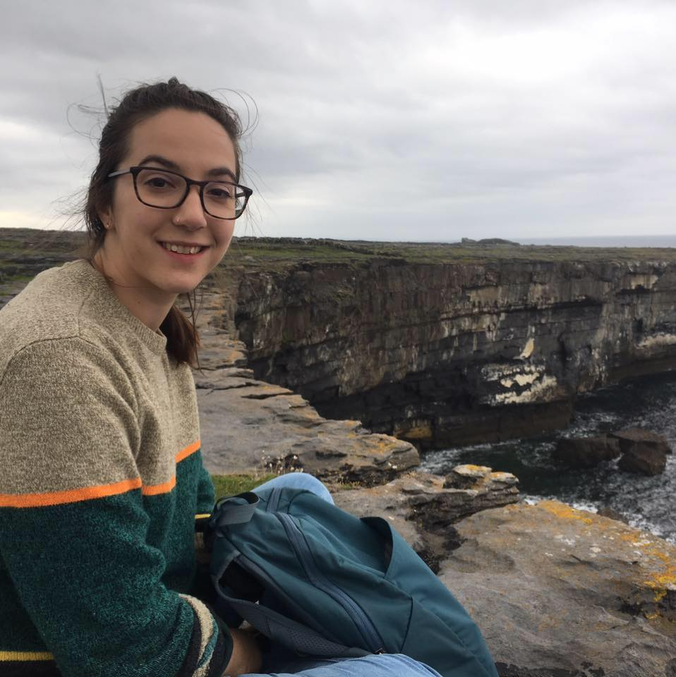

<link rel="stylesheet" href="https://cdnjs.cloudflare.com/ajax/libs/font-awesome/4.7.0/css/font-awesome.min.css">

###Isabel Erickson

I've had the opportunity to conduct independent research and contribute to research projects as an IRTA postbac at the NIH and as an undergraduate student at Swarthmore College. So far, most of my [projects](projects.html) have involved microbiome research, which means that I have plenty of experience managing and analyzing large amounts of data, handling and managing biological samples, and coding. I'm excited to apply these skills to clinical research and am particularly interested in behavioral biology and clinical psychology.

I also have experience with scientific writing, literature review, experimental design, and with leadership and teaching.

[Access my CV](cv.html)

###Get in touch

<i class="fa fa-envelope"></i> <a href="mailto:isabel.rois.erickson@gmail.com">Email Me</a>  

<i class="fa fa-twitter"></i> [Twitter](https://twitter.com/IsabelRErickson)

<i class="fa fa-github"></i> [Github](https://github.com/isabel-erickson)

