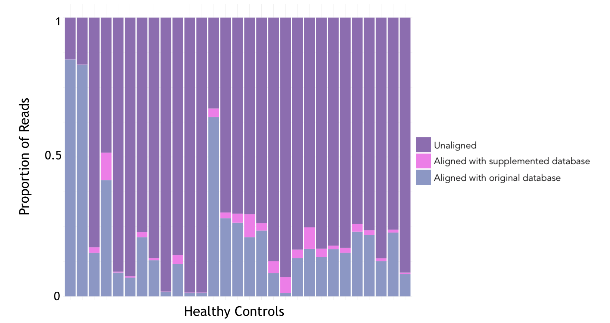
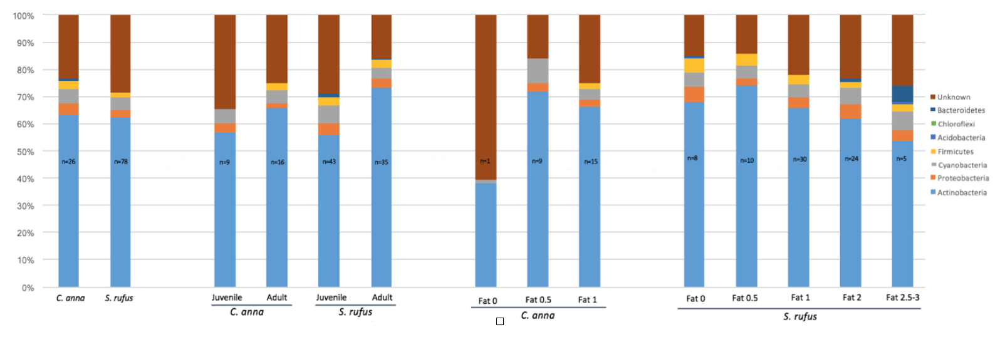

##Improving Reference-Based Methods of Classifying Metagenomic Sequences

Shotgun metagenomics has important advantages over other methods of characterizing microbial diversity. Unlike amplicon sequencing, shotgun metagenomics allows for direct comparisons between kingdoms and can provide information about microbial function and strain. However, shotgun metagenomics relies on libraries of reference genomes. The quality of the reference library used determines what information can be obtained. 

Another problem with shotgun metagenomics is that a proportion of metagenomic reads cannot be mapped to reference databases. I've worked to reduce this problem by aligning unmapped reads from healthy volunteers to public databases using BLAST. I mapped 29% of these reads using this method and found that 23% of these newly mapped reads were contaminants from diverse environmental sources.

At the same time, I cultured thousands of bacterial isolates from clinical samples in an effort to improve characterization of microbiome's strain diversity.

I gave a talk on my work on this issue at a NIH Translational and Functional Genomics branch meeting in 2019. You can view my slides [here](branch.html).

You can access some of the code that I wrote while working on this project [here](https://github.com/isabel-erickson/NIH-code).

##Hummingbird Microbiome

As an undergraduate at Swarthmore College, I characterized the gut microbiota of migratory and nonmigratory hummingbirds. Studying the gut microbiomes of migratory nectarivores provides a lens towards understanding the role of gut microbiota in mediating migration-associated fat cycles without additional calories made available as a product of microbial catabolism. Both species are hosts to large proportions of Corynebacterium.

View my poster presentation at ASM [here](Erickson.Poster.png).

