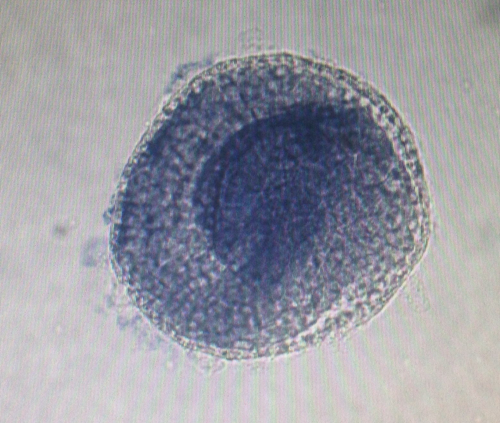
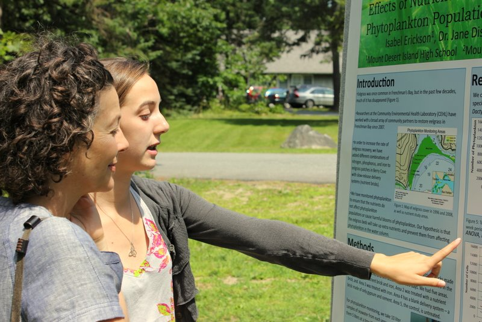

##Improving Reference-Based Methods of Classifying Metagenomic Sequences

Characterization of the human microbiome using shotgun metagenomics requires mapping microbial reads to libraries of reference genomes. However, proportion of metagenomic reads cannot be mapped to existing reference databases. I conducted independent research to align unmapped shotgun metagenomic reads to reference libraries. I conducted independent research to address this problem. Using BLAST, I aligned 29% of the unmapped DNA from healthy volunteers to public databases. I discovered that diverse environmental contaminatants were contributing to the problem of unmapped DNA in these samples.

At the same time, I cultured thousands of bacterial isolates from clinical samples in an effort to improve characterization of the microbiome's strain diversity.

I gave a talk on my work on this issue at a meeting for the National Human Genomics Research Institute's Translational and Functional Genomics branch in 2019. You can view my slides [here](branch.html).

You can access some of the code that I wrote while working on this project [here](https://github.com/isabel-erickson/NIH-code).
   
------  
   
##Hummingbird Microbiome 

As an undergraduate at Swarthmore College, I characterized the gut microbiota of migratory and nonmigratory hummingbirds. Studying the gut microbiomes of migratory nectarivores provides a lens towards understanding the role of gut microbiota in mediating migration-associated fat cycles without additional calories made available as a product of microbial catabolism. Unusually, these nectarivores are hosts to large proportions of *Corynebacterium*.

View my poster presentation at ASM [here](Erickson.Poster.png).
   
------   
   
##Mouse Microbiome 

As a part of a project for an honors seminar at Swarthmore College, I worked with a group of peers to characterize the microbiomes of mice with unexpected immunological phenotypes (inverted CD4/CD8 T-cell counts). These mice had been identified by a collaborator, who provided us with fecal samples from the mice. We hypothesized that the microbiomes of the mice might affect their T-cell counts and so purified and amplified bacterial DNA from samples. I then performed data processing and preliminary analysis and returned the data to a collaborator for further analysis.
   
   
------  
   
##Development of Left-Right Asymmetry in *Ciona*
##*intestinalis*

While working on a collaborative research project in a developmental biology lab at Swarthmore College, I conducted experiments that suggest that the development of left-right asymmetry in *Ciona intestinalis* depends on the presence of the embryonic chorion but not on asymmetric expression of the nodal signalling pathway. This was a surprising and exciting finding.
   
------

   
##Effects of Nutrient Enrichment on Phytoplankton Populations in Frenchman's Bay

As a high school student, I had the opportunity to complete an internship at the Mount Desert Island Biological Laboratory (MDIBL). This was were I was introduced to scientific research and decided to pursue a scientific career. At MDIBL, I worked in an environmental health laboratory that worked to restore eelgrass populations and to monitor phytoplankton blooms in Frenchman's Bay. I completed a project that studied the effects of nutrient enrichment on marine phytoplankton populations in several locations within the bay. I also monitored phytoplankton populations for toxic phytoplanktons.
